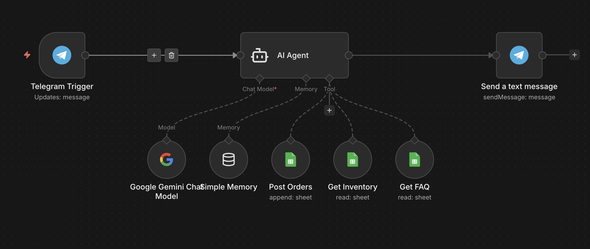
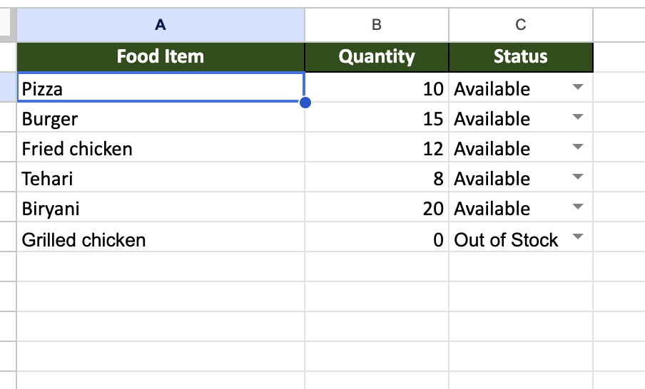
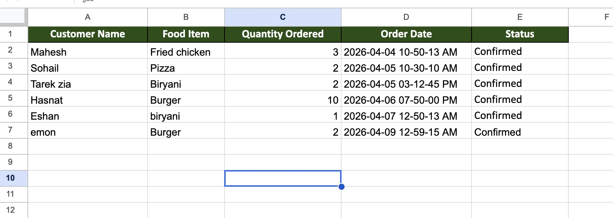
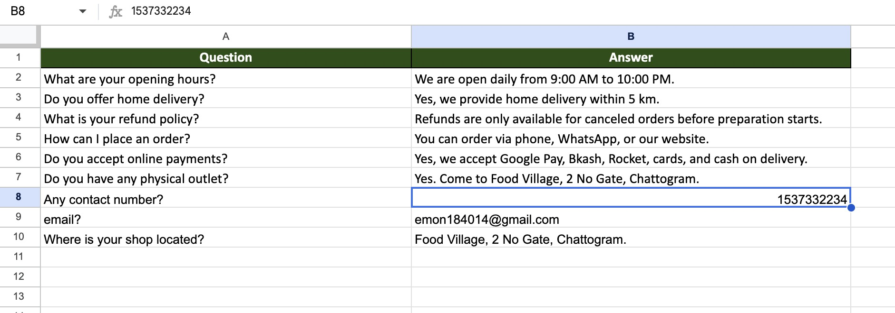

# Food-village-telegram-chatbot-n8n
AI-powered food ordering chatbot built with n8n, Telegram Bot API, and Google Sheets. Handles customer orders, checks inventory, and manages order records automatically.

# 🍽️ Food Village — AI-Powered Telegram Chatbot

An AI-powered food ordering chatbot built using n8n automation. 
Customers interact naturally via Telegram, and the AI agent handles 
inventory checking, order confirmation, and database management 
automatically through Google Sheets.

## Demo
▶️ [Watch Demo on YouTube](https://youtu.be/-FtMMOdTwaE)

## Features
- Natural conversation with customers via Telegram
- Real-time inventory checking from Google Sheets
- Automatic order confirmation with stock validation
- Notifies customer if item is out of stock
- Creates order records automatically in Google Sheets
- FAQ handling for common customer questions
- Custom AI prompt for professional customer service behavior

## Tools Used
- n8n Cloud — Workflow automation
- Telegram Bot API — Customer messaging
- Google Gemini API — AI agent
- Google Sheets API — Live database

## Workflow Structure
```
Telegram Trigger
       ↓
AI Agent (Google Gemini)
       ↓
Google Sheets Tool (Read Inventory + FAQ)
       ↓
IF Order Confirmed + In Stock
       ↓
Google Sheets Tool (Write to Orders)
       ↓
Telegram (Send reply to customer)
```

## Screenshots

### n8n Workflow


### Inventory Database


### Orders Database


### FAQ Database


### Telegram Bot in Action

